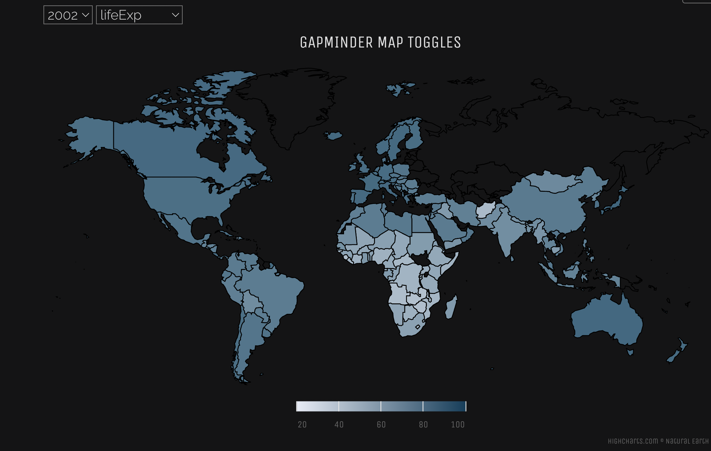
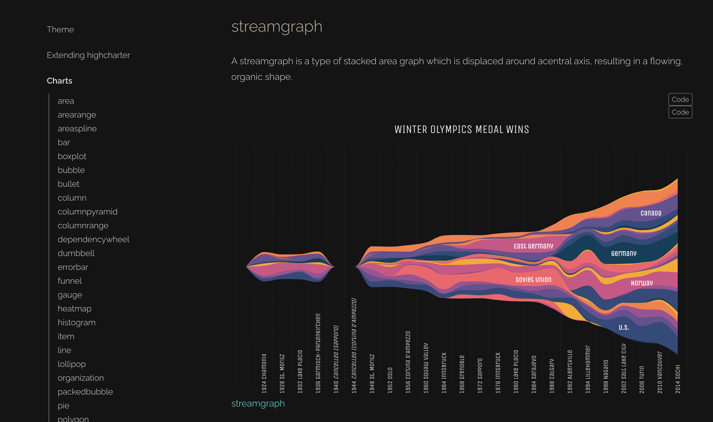

<!-- README.md is generated from README.Rmd. Please edit that file -->

```{r, include = FALSE}
knitr::opts_chunk$set(
  collapse = TRUE,
  comment = "#>",
  fig.path = "man/figures/README-",
  out.width = "100%"
)
```

# highchart.extensions

The goal of this document is to provide a fairly comprehensive translation of highcharts.js plots within R. It attempts to combine references found on the official highcharter website, in addition to filling in gaps with highcharts.js examples, and other plots.

It also provides a small extension to the highcharter library which allows anyone to create runtime like toggles within an existing highcharter plot definition within a statically rendered document (like an rmarkdown html output).

``` r
# install.packages("devtools")
devtools::install_github("zac-garland/highchart.extensions")
```

## Example

This is a basic example which shows you how to solve a common problem:

```{r example,eval=FALSE}
library(highchart.extensions)

gapminder::gapminder |>
  mutate(iso_2 = countrycode::countrycode(country, "country.name", "iso2c")) |>
  filter(country != "Kuwait") |>
  gather(key, value, lifeExp:gdpPercap) |>
  hcmap(
    map = "custom/world",
    download_map_data = TRUE,
    joinBy = c("iso-a2", "iso_2"),
    name = "",
    nullColor = "transparent",
    borderColor = "black",
    value = "value"
  ) |>
  hc_colorAxis(minColor = "#e6ebf5",maxColor = getOption("highcharter.color_palette") %>% tail(1)) %>% 
  hc_title(text = "Gapminder Map Toggles") %>% 
  # hc_add_theme()
  add_multi_drop(
    c("year", "key"),
    c("2002", "lifeExp")
  )


```

 


